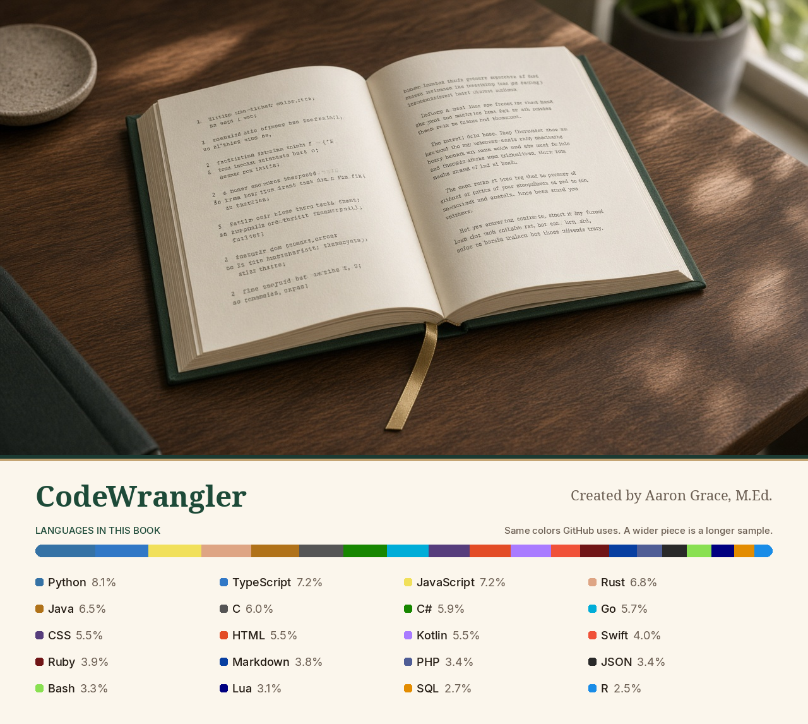

# CodeWrangler



A book that explains code in everyday words.

Created by Aaron Grace, M.Ed.

The left page holds the code. The right page says what it means, the way you would explain it to a neighbor. You can paste your own code, turn through a sample of many languages, try a small demo, and read how GitHub and AI work.

## Read the book

The printed pages do not need an account. Open the app and turn the pages. The arrow keys turn the page when you are not typing.

Chapters:

- **Welcome** — how the two pages work
- **Your code** — paste a page and ask what it does
- **Languages** — a short sample of JavaScript, TypeScript, Python, HTML, CSS, SQL, Java, C#, Go, Rust, Swift, Kotlin, Ruby, PHP, C, Bash, R, Lua, JSON, and Markdown
- **Demos** — a tip, a coin jar, a chore list, and a porch light, with the code beside the thing you can click
- **Good habits** — names, one job at a time, the odd cases, saying a rule once, keeping secrets off the page, and notes a person can use
- **GitHub** — repositories, commits, branches, pull requests, issues, the README, and releases
- **How AI works** — what a model is, tokens, providers, keys, what leaves your computer, and how to read an answer

## Ask a model

Settings is in the top corner, and also in the Book menu. Choose a provider, choose a model, and paste a key. The key stays on this computer. When the computer can lock it, CodeWrangler does that. Nothing is sent until you ask.

| Provider | What it is | Where to make a key |
| --- | --- | --- |
| OpenAI | GPT-6.1 Sol, GPT-6 Luna, GPT-6 Astra, and other current GPT models | https://platform.openai.com/api-keys |
| Anthropic | Claude Sonnet, Opus, Fable, and Haiku | https://console.anthropic.com/settings/keys |
| OpenRouter | One key for recent models from many companies | https://openrouter.ai/keys |
| Ollama Cloud | Models hosted by Ollama, such as Gemma and gpt-oss | https://ollama.com/settings/keys |

You can refresh the model list, or type a model id yourself. A provider may charge for a reply. CodeWrangler does not add a fee.

The reading voice changes only the model’s wording: everyday words, a curious beginner, or a teacher’s detail. The printed chapters stay in everyday words.

## Install a release

Releases are packed for Mac, Windows, and Linux. Download the file for your computer from the project’s Releases page.

The first time you open the app, your computer may ask you to confirm. That happens because this project does not include a paid signing certificate. On a Mac, right-click the app and choose Open. On Windows, choose More info, then Run anyway.

## Build it yourself

You need Node.js 22.

```bash
npm install
npm test
npm run dev
```

`npm run build` makes the app files. `npm run dist` packs them for the computer you are using.

A release for all three systems is built by GitHub when a version tag is pushed. The tag has to match the version in `package.json`. For this book, that tag is `v1.0.1`.

```bash
git tag v1.0.1
git push origin v1.0.1
```

## License

Apache License 2.0. See `LICENSE` and `NOTICE`.
